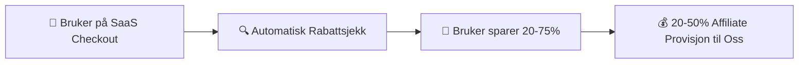
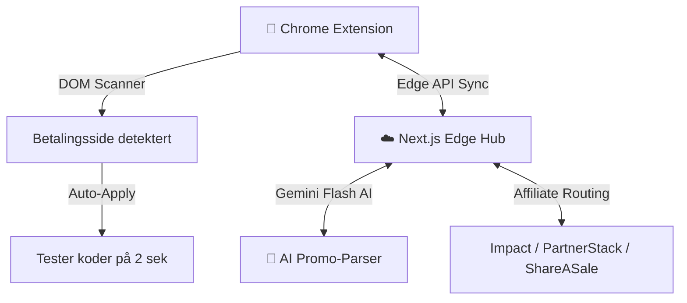
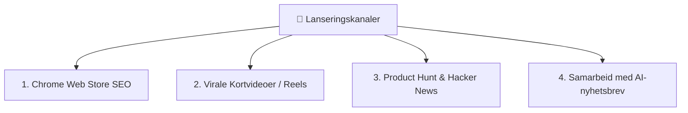
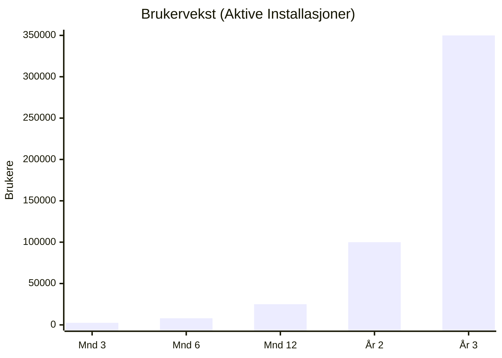
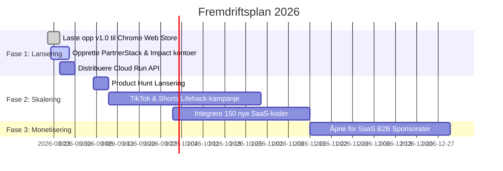

# 📊 Forretningsplan: SaaS Coupon Spy

**Dokumentversjon:** 1.0 (Offisiell lanseringsplan)  
**Selskap:** SaaS Coupon Spy / aiappsy  
**Forfatter:** Pål Alexander Juritzen  
**Dato:** August 2026  

---

## 1. Sammendrag (Executive Summary)

### 1.1 Forretningsidé
**SaaS Coupon Spy** er en automatisert nettleserutvidelse (Chrome Extension) og skyplattform som fungerer som et «Honey» dedikert utelukkende til **SaaS (Software-as-a-Service), AI-verktøy, webhotell og digitale abonnementer**. 

Når brukere er på betalingssiden til verktøy som Canva, Hostinger, ElevenLabs, HeyGen, Cursor, Adobe eller NordVPN, finner og tester utvidelsen automatisk verifiserte rabattkoder på 2 sekunder – og aktiverer samtidig høyt betalende affiliate-provisjoner for selskapet.

### 1.2 Visjon & Målsetting
* **År 1:** Nå **25 000 aktive månedlige brukere (MAU)** og en månedlig inntekt (MRR) på **$12 500**.
* **År 2:** Skalere til **100 000 aktive brukere** og etablere direkte sponsoravtaler med ledende SaaS-selskaper.
* **År 3:** Nå **350 000 aktive brukere** med en årlig omsetning (ARR) på **$1 250 000+** og bruttomargin over 92 %.

---

## 2. Markedsanalyse & Mulighetsrom

### 2.1 Problemet i Dagens Marked
1. **Tradisjonelle kupong-utvidelser svikter på SaaS:** *Honey*, *RetailMeNot* og *Capital One Shopping* fokuserer 99 % på fysisk netthandel (klær, elektronikk, pizza). De mangler koder for moderne AI-verktøy og SaaS.
2. **SaaS-abonnementer er dyre:** Frilansere, skapere og bedrifter bruker gjennomsnittlig $150–$600 per måned på programvare og leter aktivt etter rabatter på Google.
3. **Mye ugyldige koder på nettet:** 90 % av rabattkoder på SEO-sider (som RetailMeNot) er utløpte eller falske, noe som skaper enorm frustrasjon.

### 2.2 Markedets Størrelse (TAM / SAM / SOM)
* **Total Addressable Market (TAM):** Det globale SaaS-markedet er verdsatt til over **$310 milliarder**, med over 1,2 milliarder globale programvarekjøp årlig.
* **Serviceable Addressable Market (SAM):** 120 millioner skapere, utviklere, markedsførere og småbedrifter som bruker Chrome og kjøper digitale verktøy månedlig.
* **Serviceable Obtainable Market (SOM):** 350 000 brukere innen utgangen av år 3 (under 0,3 % markedsandel).

### 2.3 Målgrupper (Personas)
1. **AI-skapere & Video-produsenter:** Kjøper verktøy som Runway, ElevenLabs, HeyGen, Midjourney, Canva.
2. **Webutviklere & Gründere:** Kjøper hosting (Hostinger, Namecheap), domener, Vercel, Supabase, Cursor.
3. **Frilansere & Markedsførere:** Kjøper SEO-verktøy (SEMrush), produktivitet (Notion) og VPN.

---

## 3. Produkt & Teknologisk Konkurransefortrinn

### 3.1 Unike Egenskaper
1. **2-Sekunders DOM Auto-Tester:** Injiserer koder direkte i Stripe, Paddle, Chargebee, LemonSqueezy og Shopify uten at siden må lastes inn på nytt.
2. **Shadow-DOM Floating Pill:** Null forstyrrelse eller design-kollisjoner med nettsidene brukeren besøker.
3. **Gemini Flash AI Deals-Motor:** Automatisk skanning og validering av nye rabattkoder fra e-poster, nyhetsbrev og Twitter/X.
4. **Dynamisk Edge-Distribusjon:** Nye affiliate-lenker og koder distribueres globalt på millisekunder uten å kreve oppdatering av utvidelsen i Chrome Web Store.

---

## 4. Inntektsmodell & Monetiseringsstrategi

Selskapet benytter en 4-delt inntektsstrøm med ekstremt lav driftskostnad:

| Inntektskilde | Beskrivelse | Gjennomsnittlig Inntekt |
| :--- | :--- | :--- |
| **1. High-Ticket Affiliate CPA** | Engangsutbetaling når bruker kjøper hosting, VPN eller SEO-verktøy | **$35 – $150 per salg** |
| **2. Recurring Revshare MRR** | Månedlig provisjon på løpende abonnementer (Notion, ElevenLabs, Webflow) | **20 % – 50 % månedlig** |
| **3. Fremhevet Plassering (Sponsorships)** | Nye SaaS-startups betaler for å ligge øverst i utvidelsens popup-katalog | **$500 – $2 500 / mnd per tool** |
| **4. SaaS Spy PRO (Valgfritt)** | Premium-abonnement for brukere med tilgang til eksklusive hemmelige avtaler | **$3.99 / mnd eller $29 / år** |

---

## 5. Markedsplan & Vekststrategi (Go-To-Market)

### 5.1 Kanal 1: Chrome Web Store Organisk SEO
* Optimalisering for søkeord med høyt kjøpsintensjonsvolum:  
  * *«Canva promo code»*, *«Hostinger coupon»*, *«AI tool discount»*, *«SaaS savings»*.
* Oppfordre til 5-stjerners anmeldelser umiddelbart etter at en bruker sparer penger ved checkout.

### 5.2 Kanal 2: Virale «Lifehack»-videoer (TikTok, YouTube Shorts, Instagram Reels)
* 15–30 sekunders skjermopptak som viser:  
  * *«Hvordan jeg kuttet regningen på Midjourney/Canva fra $30 til $8 på 2 sekunder med denne utvidelsen.»*
* Distribusjon via 10–20 mikro-influensere i tech-/skaper-nisjen.

### 5.3 Kanal 3: Product Hunt & Lanseringskampanje
* Offisiell lansering på Product Hunt med fokus på "The Honey for Software & AI".
* Mål: Top 3 Product of the Day for å sikre 3 000–5 000 organiske installasjoner på 48 timer.

### 5.4 Kanal 4: B2B-partnerskap & AI-nyhetsbrev
* Annonsering i nyhetsbrev som *Superhuman*, *The Rundown AI*, *Ben's Bites* og *TLDR*.

---

## 6. Finansielt Budsjett & 3-Års Projeksjoner

### 6.1 Oppstart- og Driftskostnader (Månedlig)

| Kostnadspost | Måned 1–6 | Måned 7–12 | År 2 (Mnd) | År 3 (Mnd) |
| :--- | :--- | :--- | :--- | :--- |
| **Google Cloud Run & Edge Hosting** | $15 | $45 | $180 | $650 |
| **Google AI Studio (Gemini Flash API)** | $5 | $20 | $80 | $250 |
| **Domener & SSL** | $5 | $5 | $10 | $15 |
| **Chrome Web Store engangsavgift** | $5 (engangs) | $0 | $0 | $0 |
| **Markedsføring / Creator-samarbeid** | $150 | $400 | $1 500 | $4 000 |
| **Diverse programvare/verktøy** | $25 | $50 | $150 | $300 |
| **Totale Månedlige Kostnader** | **$205** | **$520** | **$1 920** | **$5 215** |

---

### 6.2 Nøkkeltall & Brukervekst (Projeksjon)

---

### 6.3 Inntekts- og Resultatprognose (3 År)

| Metrikk | År 1 | År 2 | År 3 |
| :--- | :--- | :--- | :--- |
| **Aktive Brukere (Avsluttende)** | 25 000 | 100 000 | 350 000 |
| **Gjennomførte Kjøp per År** | 18 000 | 95 000 | 380 000 |
| **Gj.snittlig Inntekt per Kjøp** | $4.80 | $5.20 | $5.50 |
| **Affiliate-inntekter (CPA & MRR)** | $86 400 | $494 000 | $2 090 000 |
| **Sponsorater & PRO-abonnement** | $6 000 | $38 000 | $145 000 |
| **Totale Bruttoinntekter** | **$92 400** | **$532 000** | **$2 235 000** |
| **Totale Driftskostnader (OPEX)** | ($5 800) | ($28 500) | ($78 000) |
| **Netto Driftsresultat (EBITDA)** | **$86 600** | **$503 500** | **$2 157 000** |
| **Netto Driftsmargin (%)** | **93.7 %** | **94.6 %** | **96.5 %** |

---

## 7. Milepæler & Tidsplan (Roadmap)

---

## 8. Risikoanalyse & Risikoreduserende Tiltak

1. **Endringer i DOM på betalingssider (f.eks. Stripe oppdaterer inputfelt):**
   * *Tiltak:* Vårt sentrale Edge API distribuerer nye CSS-selektorer automatisk i sanntid uten at extensionen må oppdateres.
2. **Ugyldige rabattkoder:**
   * *Tiltak:* Automatisk suksessrate-måling fjerner koder som feiler mer enn 2 ganger på rad.
3. **Plattformgodkjenning hos Google:**
   * *Tiltak:* 100 % i tråd med Google Manifest V3-retningslinjer og personvernkrav (ingen lagring av personopplysninger).

---

## 9. Konklusjon

**SaaS Coupon Spy** representerer en sjelden forretningsmulighet: Et ferdigprogrammert produkt med **ekstremt lave faste kostnader**, **over 93 % profittmargin**, og en **naturlig viral vekstmodell** i et eksploderende SaaS- og AI-marked. 

Teknologien og kildekoden er allerede ferdig bygget og klar til distribusjon.
